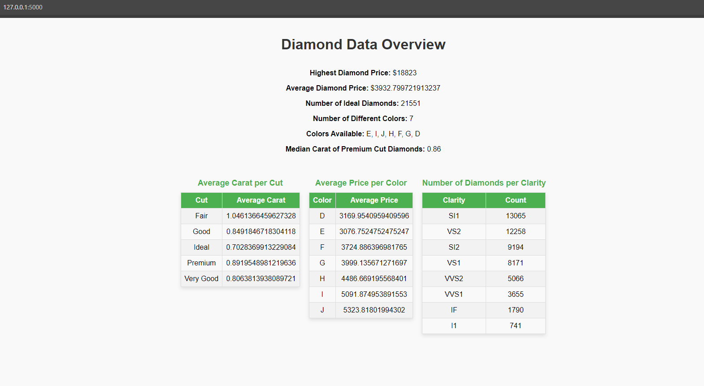

# Diamond Data Flask App

This is a simple Flask web application that displays diamond data analysis. It uses `pandas` for data processing and renders the results in an HTML table format.

## Features

- Displays the highest and average diamond prices.
- Shows the number of Ideal diamonds.
- Displays the number of diamonds in each color and clarity.
- Shows the median carat of Premium cut diamonds.
- Provides tables showing average carat per cut and average price per color.

## Requirements

The required Python packages are listed in the `requirements.txt` file. You can install them using the following command:

```bash
pip install -r requirements.txt
```

## Files

- `app.py`: The Flask application that processes the diamond data and renders it into the `index.html` template.
- `index.html`: The HTML file that contains the layout and styles for displaying the diamond data in a pretty format.
- `requirements.txt`: The list of required Python packages for the app.

## How to Run

1. Install the dependencies:

```bash
pip install -r requirements.txt
```

2. Place the `diamond.csv` file in the same directory as `app.py`.
3. Run the Flask app:

```bash
python app.py
```

4. Open your browser and go to `http://127.0.0.1:5000/` to view the app.

## Screenshot



## License

This project is licensed under the MIT License.
